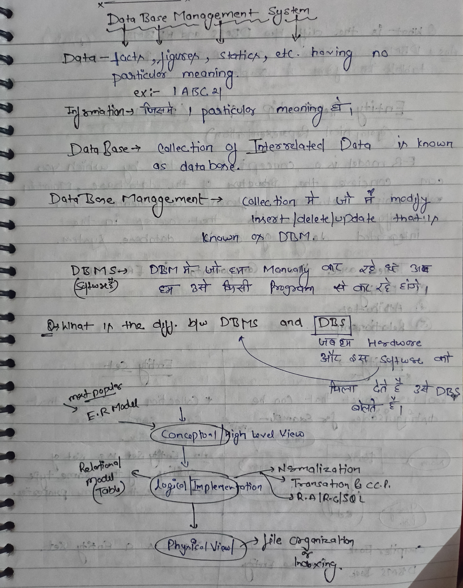
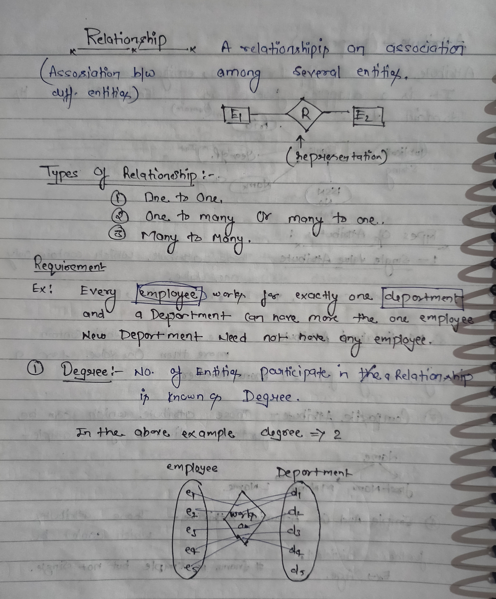
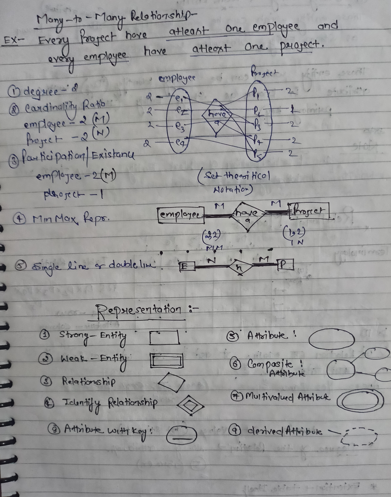
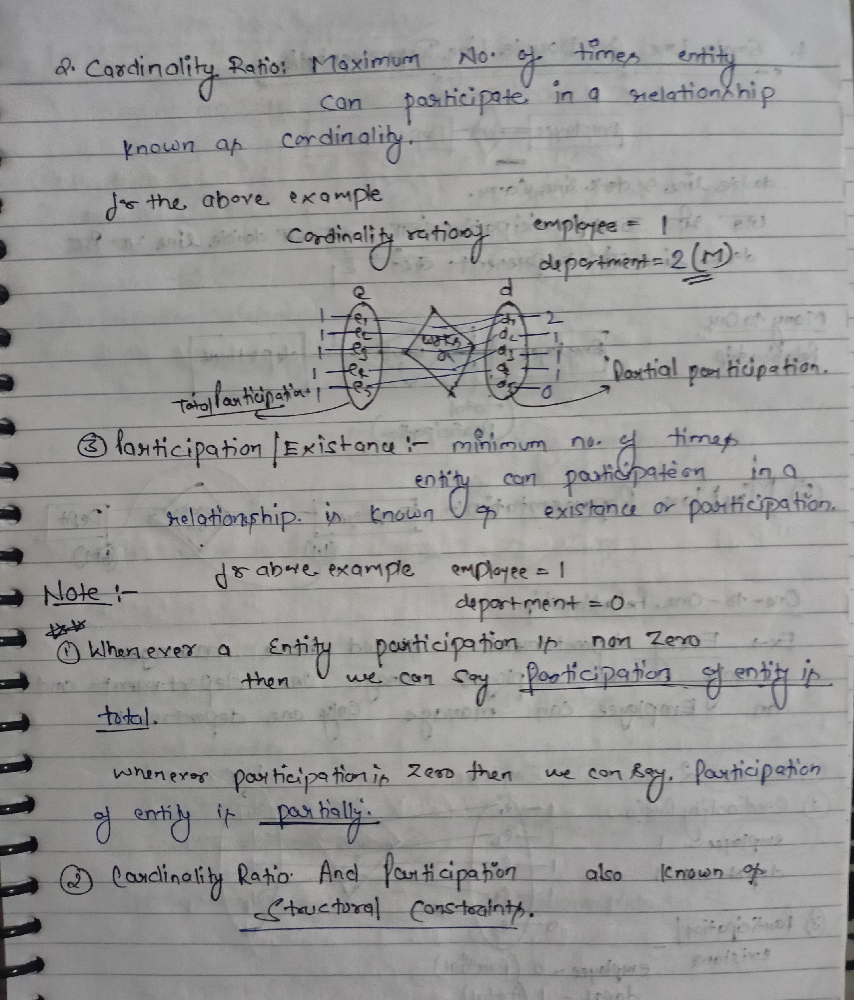

<h1 align="center">Interview Preparation 💥</h1>

**[Database-Management-System-Placement-Notes 👉](https://github.com/mukeshdani/Database-Management-System-Placement-Notes)** *Complete DBMS Hand Written Notes for Placement*

 Complete Theory of **DBMS**, **SQL**, **Normalization**, **Transaction And Concurrency Protocols** , **Relational Algebra** , **File Organization** and Other Related topics  :)

 ## Platform 👇

-[GFG](https://www.geeksforgeeks.org/dbms/)

-[YouTube](https://www.youtube.com/)

-[Pepcoding](https://www.pepcoding.com/)

-[Nados](https://nados.pepcoding.com/)

-[Visual Studio code editor](https://code.visualstudio.com/)

### contact 
💼 Pull requests help you collaborate on code with me [issues and pull requests](https://github.com/mukeshdani/Data-Stractures-and-algorithms-/pulls) :)

 💼 if you have any doubt? do reach, [email](mailto:mukeshdani00@gmail.com) :)

## Introduction: 

## Relationship

